

  

Contents:

- [Contribution Summary](#contrib)
  - [Caffe Deep Learning Library](#caffe)
  - [OpenCV Extra](#opencv_extra)
  - [OpenCV Contrib](#opencv_contrib)
  - [Future Work](#future_work)
- [Community Bonding Period](#bonding)
- [Phase 1 : Training on ImageNet](#phase_1)
- [Phase 2 : Training on PASCAL VOC](#phase_2)
  - [Loss Function](#loss)
- [Visualizations](#viz)
- [Phase 3 : Deep Compression](#phase_3)
  - [Why Compress the Network](#why_compress)
  - [Network Pruning](#pruning)
  - [Quantization](#quantization)
- [Results](#results)
- [Final Note](#ending)

Hey there !!   
I'm applying for Google Summer of Code 2017 under [OpenCV](https://www.opencv.org) where
I plan to work on the task of object detection by developing highly compact models.
You can find my proposal [here](https://docs.google.com/document/d/1zUxaQ4WYM211WaS17Dbe1jHlNeN7Twt0Aws5tt1zKXU/edit?usp=sharing).
I will blog the progress of my GSoC project here! 
Yayy! Got selected to Google Summer of Code 2017. Looking forward to a great
summer !

## Fast-Forward to the end of GSoC - "Contribution Summary"

**Mentor**: Vladimir Tyan

#### What part of the proposal is complete ?
- Training a Deep Learning model on ImageNet 2012 dataset for Image Classification
- Implementation of loss function as outlined in [this paper](https://arxiv.org/abs/1612.01051). Caffe Deep Learning framework was used as part of the implementation of loss function.
- Training a Deep Learning model on PASCAL VOC Dataset for Object Detection

#### Contribution to Caffe Deep Learning Library
- Link to Caffe Fork: [link](https://github.com/kvmanohar22/caffe)
- Commit History: [link](https://github.com/kvmanohar22/caffe/commits/obj_detect_loss)
- This contribution is specific to **Caffe** and is not ported to `opencv's dnn module`

#### Contribution to opencv_extra repository
- This includes the model weights for SqueezeNet Model trained on ImageNet as well as model weights for SqueezeDet Model trained on PASCAL VOC.
- Link to [PR #367](https://github.com/opencv/opencv_extra/pull/367)
- List of commits : [commits](https://github.com/opencv/opencv_extra/pull/367/commits)
- List of changed files: [files](https://github.com/opencv/opencv_extra/pull/367/files)

#### Contribution to opencv_contrib repository
- This repository includes the implementation of post-processing methods required to be processed on the model predictions.
- Link to [PR #1253](https://github.com/opencv/opencv_contrib/pull/1253)
- List of commits : [commits](https://github.com/opencv/opencv_contrib/pull/1253/commits)
- List of changed files: [files](https://github.com/opencv/opencv_contrib/pull/1253/files)

#### Future Work to be done
- Implementation of Model Compression methods in order to reduce the size of the model

Let's begin from `t=0`

## Community Bonding Period
As outlined in my proposal I'll be working on the task of Object Detection which
involves generating bounding boxes for the detected objects in an image. I've
divided my entire timeline into three major phases which includes:  
- Training a Deep Learning Model on ImageNet dataset for Image Classification
- Adding additional layers to the above trained model and retraining on PASCAL
  dataset
- Implement Deep Compression methods to reduce the size of the model

During this period I spent my time in setting up my developement environment on the
server by installing [Caffe](https://github.com/BVLC/caffe) Deep Learning framework,
downloading the humongous [ILSVRC-2012 dataset](http://image-net.org/), reading up the
research papers outlined in my proposal. Caffe is a great framework but what it lacks
is documentation and tutorials for a beginner :(. Constrained to implement my project in
C++,  I had to go through the [official API](http://caffe.berkeleyvision.org/doxygen/annotated.html)
and figure out myself what's happening under the hood. Luckily I had a bit of experience working
on Google Protocol Buffers which is largely used in Caffe for defining various core classes.
Having used Caffe throughout the summer,
I dedicated a [blog post](https://kvmanohar22.github.io/Caffe/) to it. This pretty much sums up my
Community Bonding Period.

## Phase 1: Training SqueezeNet Model on ImageNet
In general Deep Learning models take up huge chunk of memory to hold the learnable parameters.
But SqueezeNet is designed so as to reduce the number of parameters in the following ways:
- Clever use of **1x1** kernels instead of **3x3** kernels which reduce the number of parameters
of that kernel by a factor of 9 !
- Usage of global pooling instead of fully connected layers for
the final classification task
- Decreasing the number of input channels to **3x3** kernels by introducing squeeze module
- Downsampling the spatial resolution late in the network so that convolutional layers have large
activation maps. This intuitively ensures that the kernels early and deeper in the network can learn
more features

This leads to a network with approx. **1.2 million** (**4.78MB** size uncompressed network) parameters
which is considerably less compared to other popular networks such as AlexNet, GoogleNet, ZFNet, VGGNet,
ResNet all of which have orders of \\(10s\\) of millions of parameters.

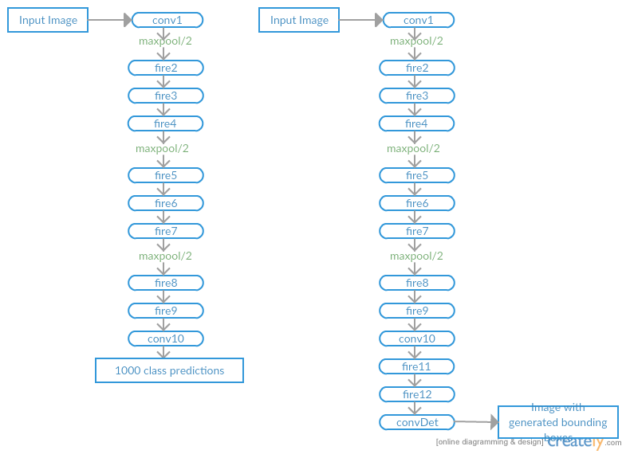
**Fig 1**: **Left** Architecture of SqueezeNet. **Right** Architecture of SqueezeDet.

Now let's come to the part of training SqueezeNet for Image Classification task. ImageNet is **the** biggest dataset of images out there of size nearly **1.2 TB** ! ILSVRC (ImageNet Large Scale Visual Recognition Competition) is a collection of subset of images from ImageNet with nearly 1.2 million images (approx. 1k images per class). There were number of challenges that I faced while fine tuning the right set of hyperparameters to kick start the training. Let's dive in. One key problem was with **Dead ReLUs** deeper in the network which continously output \\(0\\). This leads to the network to a never changing state. Catching this problem was pretty easy by analyzing the training loss as a function of number of iterations and analyzing the distributions of activation maps of Convolutional layers. Here are some of the visualizations during the training phase.

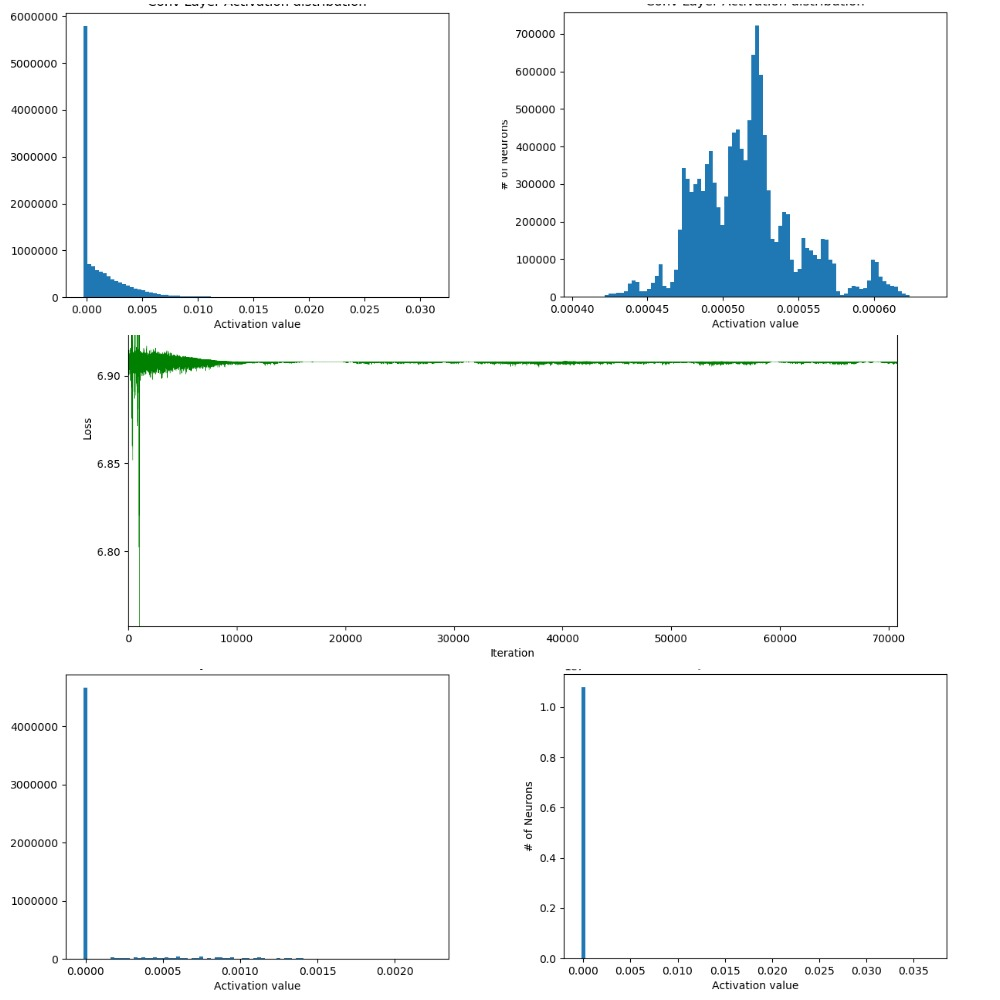
**Fig 2**: Training which didn't converge. **Top row:** Histogram distribution of activation maps of
conv layers at the top of the network. **Middle row:** Loss function which didn't converge.
**Bottom row:** Histogram distribution of activation maps of conv layers towards the end of the network.
The difference between distributions in the top and bottom row clearly indicate the problem with
**Dead ReLUs**.

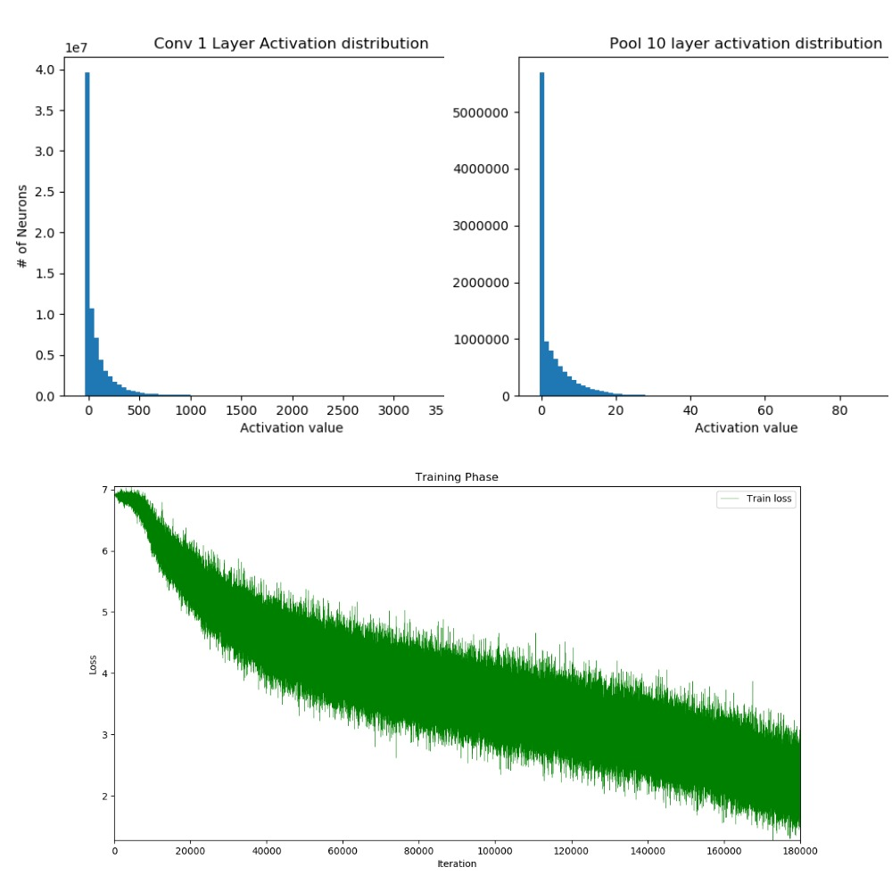
**Fig 3**: Training which did converge ! One can infer from the histogram distribution that the weights
are distributed over good range of values.

So, why the problem with **Dead ReLUs** and how to get over it? There could be ample reasons.
Bad weight initialization (You might want to have a look at [this](https://github.com/kvmanohar22/DeepNets)),
high learning rate to pick a couple. The solution to this could be to use Leaky ReLU (should be experimented,
worked in my case with \\(\alpha = 0.001\\)), try with smaller learning rate. Let's dive into some math here.
Mathematically,

Let the activation map of Conv layer be denoted by \\(A_i\\) for the \\(i\\) th kernel. Here \\(X_{jk}\\)
is the input tensor to the conv layer.

\\(A_i = \sum W_i*X_{jk}\\)

Applying ReLU non-linearity element-wise results in \\(B_i\\) where,

\\(B_i = max(0, A_i) \\)

During the backward pass, we have \\(\Large \frac{\partial{L}}{\partial{B_i}}\\) coming from the
bottom layer (\\(L\\) being the loss function). To update the weights \\(W_i\\) we need to compute
\\(\Large \frac{\partial{L}}{\partial{W_i}}\\) which is done as follows:

$$
\frac{\partial{L}}{\partial{A_i}}=\frac{\partial{L}}{\partial{B_i}} \frac{\partial{B_i}}{\partial{A_i}}
 \quad and \quad \frac{\partial{B_i}}{\partial{A_i}} = \begin{cases}1 & \text{if $A_i$ $\gt$ $0$} \\[2ex]
0 & \text{otherwise}
\end{cases}
$$

Now,

$$
\frac{\partial{L}}{\partial{W_i}} = \frac{\partial{L}}{\partial{A_i}}\frac{\partial{A_i}}
{\partial{W_i}} \quad and \quad \frac{\partial{A_i}}{\partial{W_i}} = \nabla_{W_{i}}{A_{i}}
$$

Finally the weight update rule (without momentum and \\(\alpha\\) being learning rate) gives us:

$$
W_i =
\begin{cases}
W_i - \Large \alpha \small \nabla_{W_{i}}{A_{i}} \Large \frac{\partial{L}}{\partial{B_{i}}} & \text{if $A_{i}$ $\gt$ $0$} \\[2ex]
W_i & \text{otherwise}
\end{cases}
$$

This above weight update rule clearly indicates why the weights of **Dead ReLUs** never change and thus
the constant loss \\(vs\\) iterations in **Fig 2** above.

Rectifying the mistakes from previous trainings and re-training the model multiple number of times with different hyperparameters, it took nearly **10 days** for the model to converge on an NVIDIA Tesla K20c GPU.

## Phase 2: Training SqueezeDet Model on PASCAL VOC
**ConvDet** (see **Fig 1** above) is largely responsible for the prediction of the bounding boxes.
Let's say input feature map to the **ConvDet** is a tensor of shape \\((W_{f}, H_{f}, Ch_{f})\\)
where \\(W_{f}\\) is the width of the feature map, \\(H_{f}\\) is the height of the feature map
and \\(Ch_{f}\\) is the number of input channels. We pad this input so that output spatial resolution
 of **ConvDet** is same as it's input. Let's denote **ConvDet's** filter width as \\(F_{w}\\) and
height as \\(F_{h}\\). The number of kernels used by **ConvDet** is \\(K(4+1+C)\\). Here \\(K\\)
 is the number of bounding boxes (also called anchors) predicted at each spatial position on the
feature map and thus \\(W_{f}H_{f}K\\) total bounding boxes predicted per image. Each anchor
is described by \\(4\\) scalars \\((\hat{x_{i}}, \hat{y_{j}}, \hat{w_{k}}, \hat{h_{k}}),
i \in [1, W], j \in [1, H], k \in [1, K]\\) (Here, \\(\hat{x_{i}}, \hat{y_{j}}\\) are spatial
 co-ordinates (in the image) of the reference grid center \\((i, j)\\) and \\(\hat{w_{k}},
 \hat{h_{k}}\\) are the width and height of the \\(k\\)-th bounding box) and the other \\(C+1\\)
values (computed by ConvDet layer) for each anchor encode the confidence score (probability
 that there is an object within that anchor) and conditional class probabilities.
 Refer **Fig 4**. Note that \\((\hat{x_{i}}, \hat{y_{j}}, \hat{w_{k}}, \hat{h_{k}})\\) are not
 directly computed by ConvDet layer. These are infact obtained after appling a transformation (Read below).

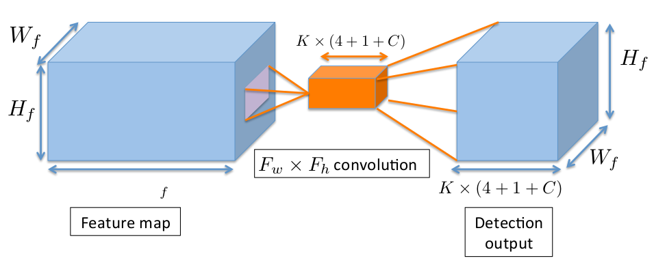
**Fig 4:** Convolution Operation producing **ConvDet's** output. (Image taken from SqueezeDet paper)

For each anchor \\((i, j, k)\\) in the Detection output (see **Fig 4**), \\(4\\) relative co-ordinates
 \\((\delta x_{ijk}, \delta y_{ijk}, \delta w_{ijk}, \delta h_{ijk})\\) are computed (by the ConvDet layer)
  which transform the anchor into a predicted bounding box. The transformation is as follows:

$$
\begin{align}
x_{i}^{p} & = \hat{x_{i}} + \hat{w_{k}} \delta x_{ijk} \\
y_{j}^{p} & = \hat{y_{j}} + \hat{h_{k}} \delta y_{ijk} \\
w_{k}^{p} & = \hat{w_{k}} \exp{(\delta w_{ijk})} \\
h_{k}^{p} & = \hat{h_{k}} \exp{(\delta h_{ijk})}
\end{align}
$$

Here \\(x_{i}^{p}\\), \\(y_{j}^{p}\\), \\(w_{k}^{p}\\), \\(h_{k}^{p}\\) are predicted bounding box
 coordinates. \\(\hat{w_{k}}\\), \\(\hat{h_{k}}\\) (in the above equation) are pre-selected values
 independant of \\((i, j)\\) unlike \\(\hat{x_{i}}\\), \\(\hat{y_{j}}\\) which change for each \\((i, j)\\).

To put everything in a nutshell, for each anchor, **ConvDet** computes \\(4\\) relative coordinates
 \\(\left(\delta x_{ijk}, \delta y_{ijk}, \delta w_{ijk}, \delta h_{ijk}\right)\\), \\(1\\) confidence score
 \\(\left(Pr(Object)*IOU_{pred}^{truth}\right)\\) and \\(C\\) conditional class probabilites \\(\left(Pr(class_{c}
 \mid Object), c \in [1, C]\right)\\). This is precisely what \\(4+1+C\\) stands for.

$$
Pr(Object) = \begin{cases}
1 & \text{if predicted bounding box overlaps with atleast one ground truth box} \\[2ex]
0 & \text{otherwise}
				 \end{cases}
$$

Alternately,

$$
Confidence \: score = \begin{cases}
IOU_{pred}^{truth} & \text{if there is overlap} \\[2ex]
0 & \text{otherwise}
\end{cases}
$$

Coming to the part of selecting pre-selected shapes for anchors i.e, (\\(\hat{w_{k}}\\),
\\(\hat{h_{k}}\\)), [Faster-RCNN](https://arxiv.org/abs/1506.01497) chooses these shapes arbitrarily
 by reshaping a \\(16\text{x}16\\) square box by \\(3\\) scales and \\(3\\) aspect ratios(\\(K=9\\)).
  [Shallow Net...](https://arxiv.org/abs/1606.01561) formulate this choice of shapes in a different way.

_"Given a set of ground truth bounding box shape observations $${(w_{i}, h_{i})}$$ find $$K$$ anchors
 such that the sum of the distance (in the shape of $$(width, height)$$) between each ground truth box
 to its nearest anchor is minimised." And this can be effectively solved using $$K$$--$$means$$_

Following suite of **Shallow Net...** and applying $$K$$--$$means$$ to PASCAL dataset produces the
following results(\\(K=9\\)).

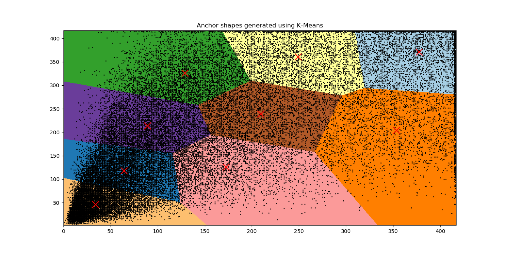
**Fig 5:** Distribution of bounding box shapes of all objects in the PASCAL dataset (A total of
\\(40138\\) bounding boxes. Means of \\(K\\) clusters are marked with red crosses. Images were reshaped
to \\(416 \times 416\\) before clustering the anchors.

**Loss function** for object detection is given by:

$$
loss = \frac{\lambda_{bbox}}{N_{obj}}\sum_{i=1}^{W}\sum_{j=1}^{H}\sum_{k=1}^{K}I_{ijk}[(\delta x_{ijk}-
\delta x_{ijk}^{G})^2+(\delta y_{ijk}-\delta y_{ijk}^{G})^2 \\
+(\delta w_{ijk}-\delta w_{ijk}^{G})^2+(\delta h_{ijk}-\delta h_{ijk}^{G})^2] \\
+\sum_{i=1}^{W}\sum_{j=1}^{H}\sum_{k=1}^{K}\frac{\lambda_{conf}^{+}}{N_{obj}}I_{ijk}(\gamma_{ijk}-
\gamma_{ijk}^{G})^2+\frac{\lambda_{conf}^{-}}{WHK-N_{obj}}\overline{I}_{ijk}\gamma_{ijk}^{2}\\
+\frac{1}{N_{obj}}\sum_{i=1}^{W}\sum_{j=1}^{H}\sum_{k=1}^{K}\sum_{c=1}^{C}I_{ijk}l_{c}^{G}\log(p_{c})
$$

This can be split into three major parts where the first part contains **bounding box regression**,
the second part contains **confidence score regression** and the last part is just the **cross entropy loss**
for classification.

Let's break down the loss function into the above mentioned three parts and understand when one image
is feed forwarded through the network.
During the forward pass, the network computes \\(\delta x_{ijk}\\), \\(\delta y_{ijk}\\),
\\(\delta w_{ijk}\\), \\(\delta h_{ijk}\\), \\(\gamma_{ijk}\\) and \\(p_{c}\\) for \\(i \in [1, W], j
\in [1, H], k \in [1, K], c \in [1, C]\\). Ground truth values are calculated as follows:

$$
\begin{align}
\delta x_{ijk}^{G} & = (x_{}^{G} - \hat{x_{i}}) / \hat{w_{k}} \\
\delta y_{ijk}^{G} & = (y_{}^{G} - \hat{y_{j}}) / \hat{h_{k}}\\
\delta w_{ijk}^{G} & = \log({w_{}^{G}/\hat{w_{k}}}) \\
\delta h_{ijk}^{G} & = \log({h_{}^{G}/\hat{h_{k}}})
\end{align}
$$

(\\(\hat{w_{k}}, \hat{h_{k}}\\)) are calculated using $$K$$--$$means$$,
(\\(\hat{x_{i}}, \hat{y_{j}}\\)) are mapped to the image. (\\(x_{}^{G}, y_{}^{G}, w_{}^{G}, h_{}^{G}\\))
are the co-ordinates of a ground truth bounding box. \\(\gamma_{ijk}^{G}\\) is the \\(IOU\\) of the
predicted bounding box with the Ground truth.

During test time, for one feed forward, we have 4761 \\(\left(W_{f}=23, H_{f}=23, K=9\right)\\) bounding boxes
which are predicted. Most of these boxes overlap for a single object. I applied **Non-Maximal-Supression**
to get rid of these redundant bounding boxes clutter and select box(s) taking into consideration
 \\(Pr(class_{c} \mid object) * Pr(object) * IOU_{pred}^{truth}\\) and the extent to which these bounding boxes overlap with one another.

Let's come to the part of training the model. With data split ratio of 3:1 for training and validation
respectively and without data augmentation, the model didn't generalise to new examples and there was
lot of overfitting.

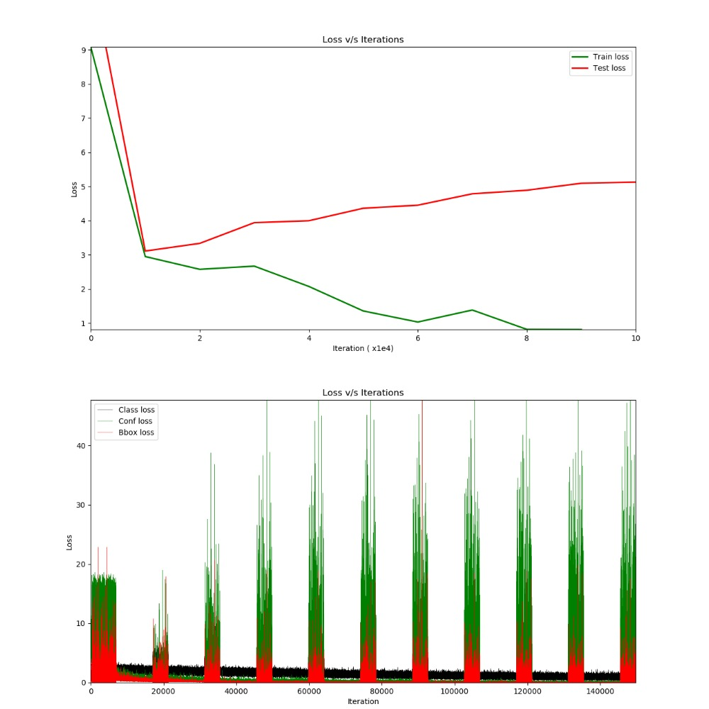
**Fig 6:** (Top) Training on PASCAL dataset which overfit the training data. (Bottom) Dissection
of entire loss into confidence score, class regression and bbox regression. The spikes in between is the loss from validation dataset.

At this point analyzing the individual losses, it was clear that there were two major problems
- Predicting more confidence values, \\(Pr(object)\\)
- Overfitting

In the first case, \\(\lambda_{conf}^{+}\\) and \\(\lambda_{conf}^{-}\\) (have a look at the
loss function) played a major role in deciding which bounding boxes come to the top \\(N\\)
category while applying Non-Maximal Supression. With \\(\lambda_{conf}^{+} = 75 \enspace and
\enspace \lambda_{conf}^{-} = 100\\) (the default values mentioned in the paper), there were many
bboxes whose confidence score was very close to 1 although they didn't contain any valid objects
under the hood. I had to come up with right
values for \\(\lambda_{conf}^{+} \enspace and \enspace \lambda_{conf}^{-}\\) to adjust the weight
of the two loss components. Fixing the value of \\(\lambda_{conf}^{+} = 75\\) and applying binary
search over \\(\lambda_{conf}^{-}\\), it turned out \\(\lambda_{conf}^{-} = 1000\\) was giving
good results.

And to address the problem with overfitting, I used **Dropout layer** along with offline data
augmentation which involved flipping the image horizontally and vertically, rotating image by a
value between \\(-45^{o} \enspace and \enspace +45^{o}\\), crop the image (top, left, bottom, right), Gaussian Blur, Average Blur, Gaussian Noise,
Contrast Normalization.

Re-training the model with the new bag of tricks seemed to work !

## Visualizations from SqueezeNet and SqueezeDet Models

Just for comparison, in Fig 7, on the left is AlexNet (obtained from [caffe model zoo](https://github.com/BVLC/caffe/tree/master/models/bvlc_alexnet) ):

- Size : **243.9MB**
- Top-1 Accuracy : **57.1%**
- Top-5 Accuracy : **80.2%**

and on the right is SqueezeNet model (trained as part of GSoC):

- Size : **4.9MB**
- Top-1 Accuracy : **56.10%**
- Top-5 Accuracy : **79.54%**

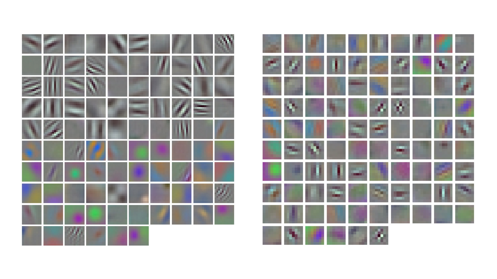
**Fig 7**: Visualization of learnable weights of the model. In total, there were 96 filters in the first Conv layer.

## Phase 3: Deep Compression
This involved application of three major methods:
- Network Pruning
- Quantization
- Huffman Coding

####  Why compress the network ?
Weights in the network whose magnitude is relatively small do not contribute a lot
to the loss and thus during backprop, these weights do not get updated to such an
extent that they make significant contribution to the loss. Large Neural Networks
constitute of many such redundant weights. To get a feel of this, **Fig. 8** shows the
weight distribution of last layer of SqueezeNet model (left) and AlexNet (right)
trained on ImageNet. Getting rid of such redundant weights in one way reduces the size
of the model. There are many methods which accomplish this task. There is a trade
off between the accuracy and the extent to which we remove such weights.

  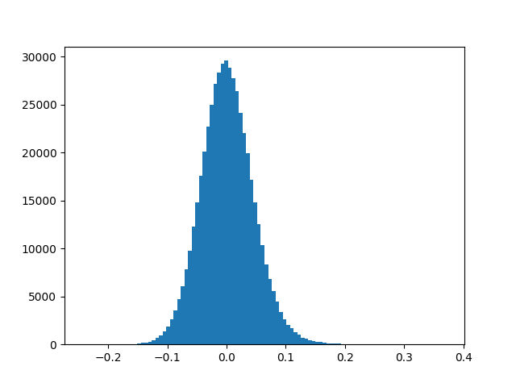
  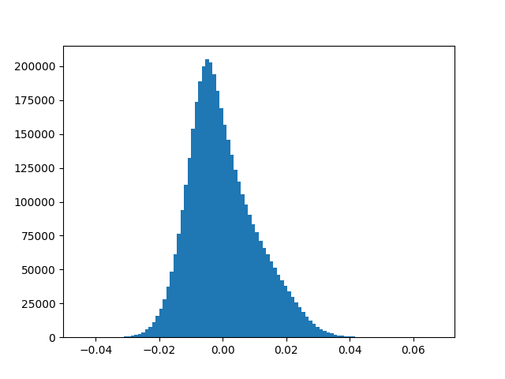
  

    <b>Fig 8</b>: Examples of weight distribution for the last layers of a neural network.
    <b>Left:</b> Last convolutional layer (<b>conv10</b>) of SqueezeNet model.
    <b>Right:</b> Last fully connected layer (<b>fc8</b>) of AlexNet model.
  

**Network Pruning** is one method which accomplishes this task and at the same
time maintains the baseline performance of the model. Network Pruning is a 3-step
process.
- Train the model as usual
- Remove the weights whose value is less than a threshold
- Retrain the model with the new set of weights.

Steps 2 and 3 can be performed iteratively to reduce the number of weights even further.

**Quantization** reduces the number of weights by clustering. Let's say there are
\\(n\\) weights in a layer, each weight can be referenced by \\(W_{i}\\) where \\(i \in [1, n]\\).
Quantization reduces the number of weights by using the same weight for multiple weights and
re-training the model to fine-tune for these shared weights. \\(n\\) original weights
$$W = \{w_{1}, w_{2}, ..., w_{n}\}$$ are clustered into \\(k\\) clusters $$C = \{c_{1}, c_{2}, ..., c_{k}\}$$
where \\(n \gg k\\). These \\(k\\) clusters which are called centroids are selected using k-means.
For each weight \\(W_{i}\\), we store index to which that weight belongs to out of the
\\(k\\) clusters instead of storing the actual value of weight itself. The change in the memory requirement with this is as follows:

Let each weight be represented using \\(b\\) bits, and let there be \\(k\\) clusters. Instead of now storing actual
weight value, one can store the index to which the weight belongs to and each of the index can
be represented using $$\log_{2}(k)$$ bits. Each weight is now represented using
$$kb + n\log_{2}(k)$$ bits. The compression rate now becomes:

$$
r = \frac{nb}{kb + n\log_{2}(k)}
$$

Ex: If there are 1000 weights, represented using 32-bit. Using 8-bit quantization \\( \left(2^{8} clusters
\right)\\), the compression ratio becomes $$1000 \times 32 \enspace / \enspace (256 \times 32 + 1000 \times 8)
\enspace = \enspace 1.98$$

#### Backpropagation on shared weights

Let the gradients wrt \\(W_{i}\\) be \\( \large \frac{\partial{L}}{\partial{W_{i}}}\\). To update the new set of
weights, we need \\( \large \frac{\partial{L}}{\partial{C_{j}}} \enspace \small for \enspace j \in [1, k]\\).
(\\(I_{i}\\) is the centroid index of the element \\(W_{i}\\)) and \\(\mathbb{1}(.)\\) is the indicator function.
Thus the gradients are calculated as follows:

$$
\frac{\partial{L}}{\partial{C_{j}}} = \sum_{i=1}^{n}\frac{\partial{L}}{\partial{W_{i}}}
\frac{\partial{W_{i}}}{\partial{C_{j}}} \enspace = \enspace \sum_{i=1}^{n}\frac{\partial{L}}{\partial{W_{i}}}
\mathbb{1}(I_{i} = j)
$$

## Results from SqueezeDet (Object Detection)

Let's feast our eyes !

Here are some of the results from the task of Object Detection.

Original Image                    |    |  Probability : 84.52%
:--------------------------------:|:--:|:--------------------------------:
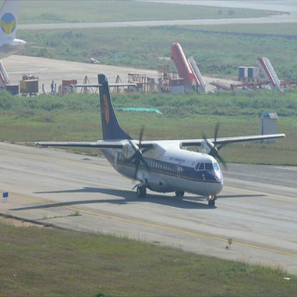  |    |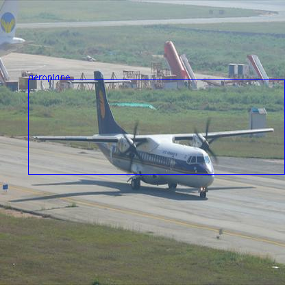

Original Image                    |    |  Probability : 70.18%
:--------------------------------:|:--:|:--------------------------------:
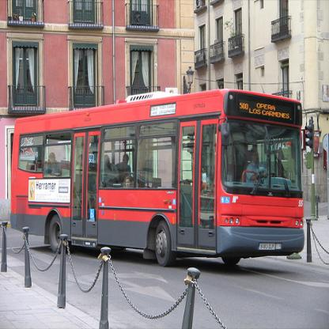   |    |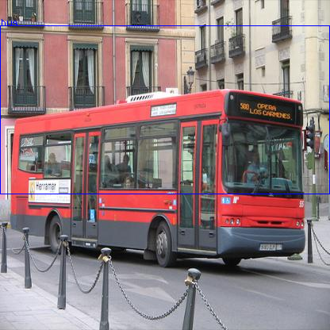

Original Image                    |   |  Probability : 70.35%
:--------------------------------:|:--|-----------------------------:
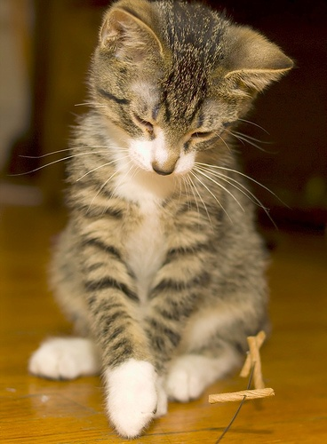   |   |

Original Image                    |    |  Probability : 74.51%
:--------------------------------:|:---|-----------------------------:
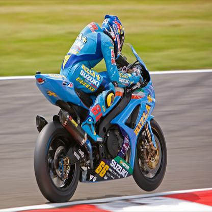  |  |

Original Image                    |    |  Probability : 73.73% & 72.03%
:--------------------------------:|:---|-----------------------------:
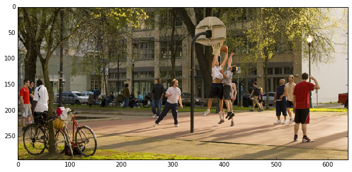|  |  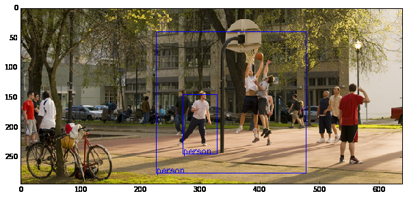

Original Image                    |    |  Probability : Boat(53.43%) & Person(53.04%)
:--------------------------------:|:---|-----------------------------:
  |    |  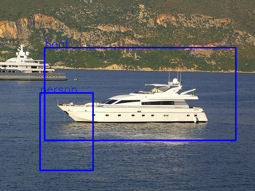

I'm exaggerating here. Hmmmm..... I myself couldn't recognize that there was a person out there on the deck !

Original Image                       |   |  Probability : Horse(74.26%) & Person(96.26%)
:-----------------------------------:|:--|------------------------------:
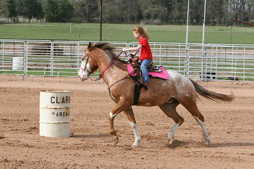  |   |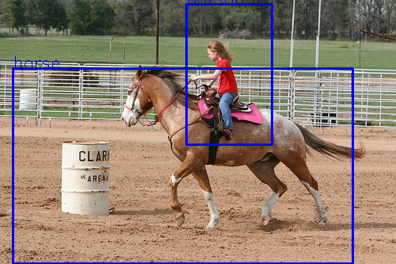

### Oops

Original Image                       |    | Probability : 74.12%
:-----------------------------------:|:---|-----------------------------:
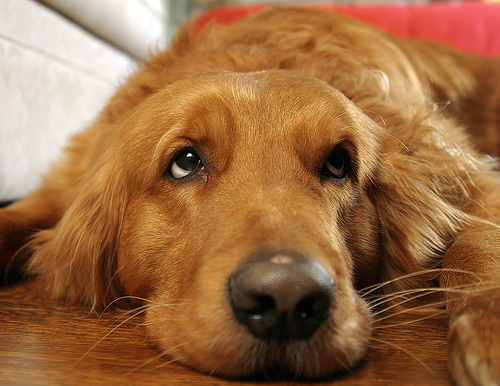  |    | 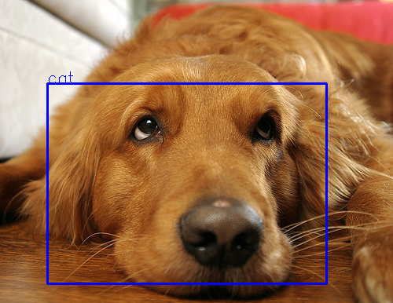

Original Image                       |    |  Probability : Train(69.65%) & Person(69.47%)
:-----------------------------------:|:---|-----------------------------:
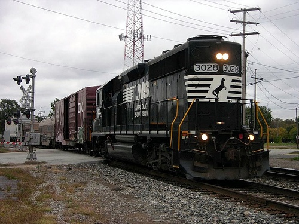  |   |  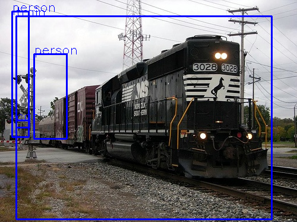

**What more ?**

Clone opencv, opencv_contrib, build, install and start detecting objects in images !

Or, having your own custom dataset and would like to train your models ? Yes, even that's possible.
Just head over to [caffe](https://github.com/kvmanohar22/caffe) and start brewing !

As a last note,

Participating in Google Summer of Code has brought me closer to the group of amazing developers and OpenCV community. I look forward to contribute to OpenCV for years to come, and I couldn't be more satisfied with the experience.

   

<noscript>Please enable JavaScript to view the <a href="https://disqus.com/?ref_noscript">comments powered by Disqus.</a></noscript>

