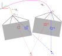
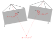
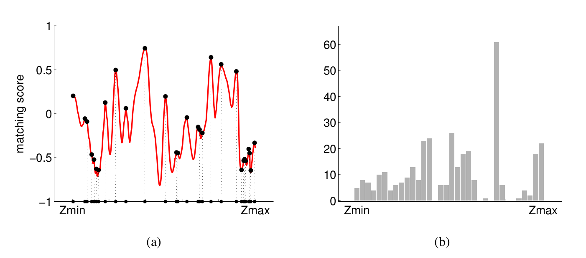
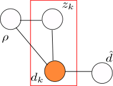
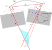
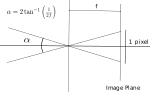

<link rel="stylesheet" href="./../css/prism.css">

This post is gonna be a bit long and mathematically more involved and covers the following topics.

- [Depth Estimation using triangulation](#triangulation)
- [Depth Estimation using sequential Bayesian updates](#bayesian)
  - [Derivation of parameters for recursive Bayesian updates](#bayesian_derivation)
  - [Variational Reasoning for approximate posterior](#bayesian_reasoning)
  - [Computing Variance in triangulation](#bayesian_variance)
- [Interesting papers for further reading on above topics](#further)
- [References](#ref)

There are multiple methods to estimate depth but what I am most interested in is estimating depth in a robust way. The ability to detect outliers arising from  dynamic objects in the scene, occlusions etc is crucial in any depth estimator. Simple triangulation unfortunately cannot do this. [1] presents a statistical analysis of depth and derives a probabilistic approach to explicitly handle outliers.

Robust depth estimation is crucial for SLAM systems. Approaches such as feature based ORB-SLAM [3] systems estimate depth by first estimating frame-to-frame egomotion and then triangulating and using the triangulated map points for egomotion estimation, loop closing etc.

On the other hand, SVO [2] approaches the SLAM problem in an incremental fashion. First estimate current frame pose relative to the last frame(not keyframe). The pose is estimated by defining photometric loss over the existing points projected into the current frame. Since this frame-to-frame motion has very small disparity, the patches corresponding to each point only move in a small amount. Next they do feature alignment by violating epipolar constraints to get better cross correlation across patches. And as a final step, motion-only BA and structure-only BA steps are carried out. What impressed me most is the fast, accurate, robust depth estimator in the backend which will be discussed in great detail in the following sections. Since each pixel is treated independently; this can be parallelized and dense reconstruction can be obtained as shown in [4].

## Depth estimation using triangulation

Simplest of all the methods; this involves solving an overdetermined system of equations. Let \\(T_1\\) and \\(T_2\\) be the camera matrices from the above two views. Then for the point \\(p_1\\);

$$
\begin{align}
u_1 = T_1 p_1 \\
u_1' = T_2 p_1
\end{align}
$$

From the above;

$$
\begin{align}
\left[u_1\right]_{\text{x}} \times T_1 p_1 = 0 \\
\left[u_1'\right]_{\text{x}} \times T_2 p_1 = 0
\end{align}
$$

where \\(\left[u_1\right]_{\text{x}}\\) is skew symmetric matrix representation of \\(u_1\\). Each of the above two equations provides two linearly independent equations. Using SVD, one can find \\(p_1\\).

## Depth estimation using sequential Bayesian updates

How do we represent depth of a pixel in a parametric way? How do we parameterize the depth in the first place? Read along to find out!

**Fig 1**: Setup

From Figure 1, let \\({\bf u}=\left(u, v\right)^T\\) be a pixel in image \\(\mathcal{I}\\). For a given depth \\(z\\), let \\({\bf p} = \left(x, y, z\right)^T\\) be the corresponding 3D point along the optical ray through pixel \\({\bf u}\\). Let \\(\mathcal{I'}\\) be another image that has \\({\bf p}\\) in it's field-of-view with \\({\bf u'}=\left(u', v'\right)^T\\) being back-projected point in the image. Let \\(W\\) and \\(W'\\) be patches around \\({\bf u}\\) and \\({\bf u'}\\) respectively. Figure 2(a) shows the Normalized Cross Correlation score for patches \\(W\\) and \\(W'\\) as \\(z\\) is varied along the optic ray through \\({\bf u}\\). Figure 2(b) shows on the other hand shows histogram of depth \\(z\\) for 60 neighbouring images measured along the optic ray through \\({\bf u}\\).

**Fig 2** Image source [1]

 

From the above plots it is statistically clear that true depth measurement is concentrated around single depth value (good measurement) and there is a lot of noise (bad measurement) albeit uniformly distributed along different depth values.

So a probability distribution that is combination of Gaussian (for good measurement) and uniform (for bad measurement) makes sense. The two are weighted by the inlier ratio \\(\rho\\) which indicates the probability of the measurement being inlier. Mathematically, given the inlier ratio \\(\rho\\) and the true depth \\(\hat d\\), the depth after \\(k^{th}\\) measurement takes the form;

$$
p\left(d_k \mid \hat d, \rho \right) = \rho \mathcal{N} \left(d_k \mid \hat d, {\tau}_k^2 \right) + (1 - \rho) \mathcal{U}(d_k \mid d_{min}, d_{max})
$$

\\(\[d_{min}, d_{max}\]\\) is the interval from which noisy depth measurements are sampled. These can be set based on the near and far plane of the camera. \\({\tau}_k^2\\) is the variance of depth by assuming 1 pixel measurement noise in the image. [Section](#compute_var) outlines how to compute \\(\tau_k^2\\).

Say we have sequence of \\(n\\) frames \\(k = \\{r, r+1, \dots, r+n \\}\\) that observe the point \\(\bf p\\) first observed in the reference frame \\(r\\). Using triangulation method described above we can generate sequence of depth hypothesis \\(\mathcal{D} = \\{d_{r+1}, \dots, d_{r+n}\\}\\) where \\(d_k^{th}\\) hypothesis is obtained by triangulating views \\(r\\) and \\(k\\).

Now that we have parameterized the depth and have sequence of depth hypothesis, how do we compute the parameters of the above density model? 

Assuming independent observations, likelihood function is given by;

$$
\begin{align}
p(\mathcal{D} \mid \hat d, \rho) & = \prod_{k=r+1}^{r+n}p(d_k \mid \hat d, \rho) \\
\end{align}
$$

The parameters of the above likelihood can be obtained in a maximum likelihood framework using Expectation Maximization. But as noted in [1], the experiments seemed to be trapped in a local optimum. Other way round? Sequential Bayesian updates to the rescue!

Posterior takes the form;

$$
p\left(\hat d, \rho \mid \mathcal{D} \right) \propto p\left(\hat d, \rho \right) \prod_{k} \left(d_k \mid \hat d, \rho \right)
$$

where \\(p\left(\hat d, \rho \right)\\) is the prior on depth and inlier ratio which is assumed to be uniform and modeled using a dense 2d histogram. Authors of [1] show that above posterior can be modelled using product of a Gaussian distribution for the depth and a Beta distribution for the inlier ratio.

$$
q \left(\hat d, \rho \mid a_k, b_k, \mu_k, \sigma_k^2 \right) = \beta \left(\rho \mid a_k, b_k\right) \mathcal{N}(\hat d \mid \mu_k, \sigma_k^2)
$$

where \\(a_k\\) and \\(b_k\\) are parameters of Beta distribution. But the choice of the posterior as product of a Gaussian and a Beta distribution could be surprising right? [Section](#bayesian_reasoning)  gives a proof of why. In fact this is the approximating distribution that minimizes KL divergence from the true posterior. Updates in the above equation are implemented in a sequential manner where posterior after \\((k-1)^{th}\\) observation is used as prior for \\(k^{th}\\) observation. Now, for \\(k^{th}\\) observation, the new posterior takes the form;

$$
p \left(\hat d, \rho \mid d_{r+1}, \dots, d_k\right) \approx \alpha  q \left(\hat d, \rho \mid a_{k-1}, b_{k-1}, \mu_{k-1}, \sigma_{k-1}^2 \right) p\left(d_k \mid \hat d, \rho \right)
$$

But the new posterior is no longer of the form \\(Gaussian \times Beta\\) but this can be approximated using moment matching. The new parameters \\(a_k, b_k, \mu_k, \sigma_k^2\\) are computed so that the posterior \\(p \left(\hat d, \rho \mid d_{r+1}, \dots, d_k\right)\\) and the approximation \\( q \left(\hat d, \rho \mid a_k, b_k, \mu_k, \sigma_k^2 \right) \\) have same first and second order moments wrt \\(\rho\\) and \\(\hat d\\). The updates are derived in the following section.

## Derivation of parameters for recursive Bayesian updates
Here I shall derive the expression for parameters in the approximated posterior form. Specifically we match the moments wrt \\(\rho\\) and \\(\hat d\\) in the posterior approximation;

$$
q \left(\hat d, \rho \mid a, b, \mu, \sigma^2 \right) = \beta \left(\rho \mid a, b\right) \mathcal{N}(\hat d \mid \mu, \sigma^2) \tag{1}
$$

and the updated posterior;

$$
p \left(\hat d, \rho \mid d_{r+1}, \dots, d_k\right) \approx \alpha  q \left(\hat d, \rho \mid a, b, \mu, \sigma^2 \right) p\left(d \mid \hat d, \rho \right) \tag{2}
$$

after \\(k^{th}\\) observation. To simplify notation subscripts are dropped. \\(a, b, \mu, \sigma^2\\) and \\(a', b', \mu', \sigma'^2\\) are the prior and posterior parameters respectively.

#### Moments of approximated posterior
Mean and variance wrt \\(\hat d\\) in equation 1 are \\(\mu'\\) and \\(\mu'^2 + \sigma'^2\\) respectively.

Similarly; mean and variance wrt \\(\rho\\) in equation 1 are \\(\frac{a'}{a'+b'}\\) and \\(\frac{a'(a'+1)}{(1+a'+b')(a'+b')}\\) respectively.

#### Moments of actual posterior

Substitute the density model in (2) to get;

$$
\begin{align}
&= \beta \left(\rho \mid a, b\right) \mathcal{N}(\hat d \mid \mu, \sigma^2) \left(\rho \mathcal{N} \left(d \mid \hat d, {\tau}^2 \right) + (1 - \rho) \mathcal{U}(d) \right) \\
&= \rho \beta \left(\rho \mid a, b\right)\mathcal{N}(\hat d \mid \mu, \sigma^2) \mathcal{N} \left(d \mid \hat d, {\tau}^2 \right) \\
& \quad \quad + (1-\rho) \beta \left(\rho \mid a, b\right)\mathcal{N}(\hat d \mid \mu, \sigma^2) \mathcal{U}(d) \tag{3}\\
\end{align}
$$

Now, using the properties of \\(\text{Beta}\\) distribution, 

$$
\beta(\rho \mid a, b) = \frac{\Gamma(a+b)}{\Gamma(a)\Gamma(b)} \rho^{a-1}(1-\rho)^{b-1}
$$

From the above;

$$
\rho \beta(\rho \mid a, b) = \frac{a}{a+b} \beta(\rho \mid a+1, b) \tag{4}
$$

and similarly;

$$
(1-\rho) \beta \left(\rho \mid a, b\right) = \frac{b}{a+b} \beta \left(\rho \mid a, b+1\right) \tag{5}
$$

Substituting (4) and (5) in (3), (2) takes the form;

$$
\frac{a}{a+b} \beta(\rho \mid a+1, b)\mathcal{N}(\hat d \mid \mu, \sigma^2) \mathcal{N} \left(d \mid \hat d, {\tau}^2 \right) \\
 + \frac{b}{a+b} \beta \left(\rho \mid a, b+1\right) \mathcal{N}(\hat d \mid \mu, \sigma^2) \mathcal{U}(d)
$$

The above can further be simplified to;

$$
\frac{a}{a+b} \beta(\rho \mid a+1, b)\mathcal{N}(\hat d \mid m, s^2) \mathcal{N} \left(d \mid \mu, \tau^2 + \sigma^2 \right) \\ 
+ \frac{b}{a+b} \beta \left(\rho \mid a, b+1\right) \mathcal{N}(\hat d \mid \mu, \sigma^2) \mathcal{U}(d) \tag{6}
$$

where

$$
\begin{align}
\frac{1}{s^2} & = \frac{1}{\sigma^2} + \frac{1}{\tau^2} \\
m & = s^2 \left(\frac{d}{\tau^2}+\frac{\mu}{\sigma^2}\right)
\end{align}
$$

First to make things simpler;

$$
\begin{align}
C_1 & = \frac{a}{a+b} \mathcal{N}(d \mid \mu, \sigma^2+\tau^2) \\
C_2 & = \frac{b}{a+b} \mathcal{U}(d)
\end{align}
$$

First integrating out (6) w.r.t \\(\rho\\) we obtain the marginal distribution over \\(\hat d\\). Mean wrt \\(\hat d\\) in (6) is given by \\(C_1 m + C_2\mu\\) and variance by \\(C_1 (s^2+m^2) + C_2(\mu^2+\sigma^2)\\)

Similarly integrating out w.r.t \\(\hat d\\) we obtain the marginal distribution over \\(\rho\\). Mean and variance w.r.t \\(\rho\\) are given by \\(C_1\frac{a+1}{a+b+1}+C_2\frac{a}{a+b+1}\\) and \\(C_1\frac{(a+1)(a+2)}{(a+b+1)(a+b+2)} + C_2\frac{a(a+1)}{(a+b+1)(a+b+2)}\\) respectively.

Equating the above mean and variances we get the following 4 equations;

$$
\begin{align}

\mu' & = C_1 m + C_2\mu \\
\mu'^2 + \sigma'^2 & = C_1 (s^2+m^2) + C_2(\mu^2+\sigma^2) \\
\frac{a'}{a'+b'} & = C_1\frac{a+1}{a+b+1}+C_2\frac{a}{a+b+1} \\
\frac{a'(a'+1)}{(1+a'+b')(a'+b')} & = C_1\frac{(a+1)(a+2)}{(a+b+1)(a+b+2)} + C_2\frac{a(a+1)}{(a+b+1)(a+b+2)} \\

\end{align}
$$

Solving the above 4 equations we get the updated parameters \\(a', b', \mu', \sigma'^2\\).

## Variational Reasoning for approximate posterior

Here, the derivation for the approximate posterior for equation (2) using factorization is provided. The Dynamic Bayesian network corresponding to the density mixture model is given in the following figure. Quantities in the red box denote \\(N\\) i.i.d data. The observed data \\((d_k)\\) is highlighted in orange.

The corresponding joint probability distribution is give by;

$$
p(D, Z, \hat d, \rho) = \left[ \prod_{k=1}^{N}p\left(d_k \mid \rho, \hat d, z_k\right)p\left(z_k \mid \rho\right) \right] p\left(\hat d\right)p\left(\rho\right) \tag{7}
$$

where \\(D = \\{d_1, d_2, \dots, d_N\\}\\) are \\(N\\) depth hypothesis and \\(Z = \\{z_1, z_2, \dots, z_N\\}\\) are the latent variables with \\(z_k = 1\\) indicating that \\(k^{th}\\) depth hypothesis is inlier. 

Restating the mixture model;

$$
p\left(d_k \mid \hat d, \rho \right) = \rho \mathcal{N} \left(d_k \mid \hat d, {\tau}_k^2 \right) + (1 - \rho) \mathcal{U}(d_k \mid d_{min}, d_{max}) \tag{8}
$$

Assuming independent initial prior, we have \\(p\left(\rho, \hat d\right) = p(\rho)p(\hat d)\\). Introducing the latent variable \\(z_k\\); we have the following;

$$
p\left(d_k \mid \hat d, \rho, z_k \right) = \mathcal{N} \left(d_k \mid \hat d, {\tau}_k^2 \right)^{z_k} \mathcal{U}(d_k)^{1-z_k} \tag{9}
$$

and 

$$
p\left(z_k \mid \rho \right) = \rho^{z_k}(1-\rho)^{1-z_k} \tag{10}
$$

By marginilizing the latent variables from (9) and (10) we get the original mixture model (8) i.e,

$$
p\left(d_k \mid \hat d, \rho \right) = \int p\left(d_k \mid \hat d, \rho, z_k \right) p\left(z_k \mid \rho \right) dz_{k}
$$ 

We now aim to approximate the posterior \\(p(\hat d, \rho, Z \mid D)\\) with \\(q(\hat d, \rho, Z)\\). Factorizing the approximate posterior as follows;

$$
q(\hat d, \rho, Z) = q(\hat d, \rho)q(Z)
$$

Now the factorized distributions are given by;

$$
\begin{align}
\ln q^{*}(Z) & = \mathbf{E}_{\hat d, \rho}\left[ \ln p \left( D, Z, \hat d, \rho \right) \right] + const \tag{11} \\ 
\ln q^{*}(\hat d, \rho) & = \mathbf{E}_{Z}\left[ \ln p \left( D, Z, \hat d, \rho \right) \right] + const \tag{12}
\end{align}
$$

What we are most interested in is equation (12).

$$
\begin{align}
\ln q^{*}(\hat d, \rho) & = \mathbf{E}_{Z}\left[ \ln p \left( D, Z, \hat d, \rho \right) \right] + const \\
& = \mathbf{E}_{Z}\left[ \ln p(\hat d) + \ln p(\rho) + \sum_{k=1}^{N}\ln p(z_k\mid\rho)+\sum_{k=1}^{N}\ln p(d_k\mid\rho, \hat d, z_k) \right] \\

& = \ln p(\hat d) + \ln p(\rho) + \mathbf{E}_{Z} \left[\sum_{k=1}^{N} z_k \ln \rho + (1-z_k)\ln (1-\rho) \right] \\
      & \hspace{3em} + \mathbf{E}_{Z} \left[\sum_{k=1}^{N} z_k \ln \mathcal{N}(d_k \mid \hat d, \tau_k^2) + (1-z_k)\ln U(d_k) \right] \notag \\

& = \ln p(\hat d) + \ln p(\rho) + \sum_{k=1}^{N} \mathbf{E} \left[z_k\right] \ln \rho + (1-\mathbf{E} \left[z_k\right])\ln (1-\rho) \\
      & \hspace{3em}  + \sum_{k=1}^{N} \mathbf{E}\left[z_k\right] \ln \mathcal{N}(d_k \mid \hat d, \tau_k^2) + (1-\mathbf{E} \left[z_k\right])\ln U(d_k) \\

& = \ln p(\hat d) + \ln p(\rho) + \sum_{k=1}^{N} \mathbf{E} \left[z_k\right] \left(\ln \rho + \ln \mathcal{N}(d_k \mid \hat d, \tau_k^2) \right) \\
      & \hspace{3em}  + \sum_{k=1}^{N} (1-\mathbf{E}\left[z_k\right]) \left( \ln (1-\rho) + \ln U(d_k)\right) \\
\end{align}
$$

Taking exponential of the above gives;

$$
\begin{align}
q^{*}(\hat d, \rho) & = p(\rho)p(\hat d) \prod_{k=1}^{N}\left(\rho\mathcal{N}(d_k \mid \hat d, \tau_k^2)\right)^{\mathbf{E} \left[z_k\right]}\left(1-\rho\right)^{1-\mathbf{E} \left[z_k\right]} \\
& =\alpha p(\rho)p(\hat d) \rho^{S}(1-\rho)^{N-S} \prod_{k=1}^{N} \mathcal{N}(d_k \mid \hat d, \tau_k^2)^{r_k} \tag{13}
\end{align}
$$

where \\(\alpha\\) is a constant, \\(r_k = \mathbf{E}\left[z_k\right]\\) and \\(S = \sum_{k}\mathbf{E}\left[z_k\right]\\). The above equation can further be factorized into two indepenent distributions over \\(\rho\\) and \\(\hat d\\) i.e,

$$
q^{*}(\hat d, \rho) = q^{*}(\hat d)q^{*}(\rho)
$$

where;

$$
\begin{align}
q^{*}(\rho) & = \alpha_1 p(\rho) \rho^{S}(1-\rho)^{N-S} \tag{14} \\
q^{*}(\hat d) &= \alpha_2 p(\hat d) \prod_{k=1}^{N} \mathcal{N}(d_k \mid \hat d, \tau_k^2)^{r_k} \tag{15}
\end{align}
$$

Now by choosing the priors over \\(\rho\\) and \\(\hat d\\) to follow uniform and Gaussian respectively; equation (14) reduces to Beta distribution and with equation (15) reducing to Gaussian.

## Computing Variance in triangulation

Variance is  \\(\tau_k^2 = \left(\vert \vert {\bf {}_r p}\vert \vert - \vert \vert {\bf {}_r p^+} \vert \vert \right)^2 \\).

Let \\(\bf t\\) be the translation component of the transformation \\({}^k T_r\\). \\({\bf {}_r p}\\) is a point \\(z\\) units away from \\(C_r\\). Let \\(\bf f\\) be the unit vector from \\(C_r\\) through the pixel \\(u\\).

$$
\begin{align}
{\bf a} & = {\bf {}_r p} - {\bf t} \\
\alpha & = \cos^{-1} \left( \frac{\bf f \cdot t}{\vert \vert \bf t \vert \vert} \right) \\
\beta & = \cos^{-1} \left( -\frac{ {\bf t} \cdot {\bf a}}{\vert \vert {\bf t} \vert \vert \cdot \vert \vert {\bf a} \vert \vert} \right) \\
\beta^+ & = \beta + 2\tan^{-1} \left( \frac{1}{2f} \right) \tag{4} \\
\gamma & = \pi - \alpha - \beta^+ \tag{5}\\
\vert \vert {\bf {}_r p^+} \vert \vert & = \vert \vert {\bf t} \vert \vert \frac{\sin \beta^{+}}{\sin \gamma} \tag{6}\\
\tau_k^2 & = \left(\vert \vert {\bf {}_r p^+}\vert \vert - \vert \vert {\bf {}_r p} \vert \vert \right)^2
\end{align}
$$

where the term added to \\(\beta\\) in equation (4) is the angle generated by the ray for 1 pixel in the image as shown in the following figure (\\(f\\) is the focal length of camera). Equation (5) ensures sum of all angles in a triangle is \\(\pi\\) and equation (6) is obtained by applying law of sines

## Interesting papers
- [Neural RGB->D Sensing: Depth and Uncertainty from a Video Camera](https://arxiv.org/abs/1901.02571)
- [Depth from Videos in the Wild: Unsupervised Monocular Depth Learning from Unknown Cameras](https://arxiv.org/abs/1904.04998)
- [Learning the Depths of Moving People by Watching Frozen People](https://arxiv.org/abs/1904.11111)

## References
[1] Video-based, Real-Time Multi View Stereo

[2] SVO: Fast Semi-Direct Monocular Visual Odometry

[3] ORB-SLAM: A Versatile and Accurate Monocular SLAM System

[4] REMODE: Probabilistic, Monocular Dense Reconstruction in Real Time

  

<noscript>Please enable JavaScript to view the <a href="https://disqus.com/?ref_noscript">comments powered by Disqus.</a></noscript>
