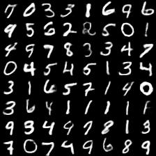

<link rel="stylesheet" href="./../css/prism.css">

This post is part of the code that I released on [github](https://github.com/kvmanohar22/Generative-Models) written in Tensorflow. This post summarizes on the problem of modelling a given data distribution using **Variational Autoencoders (VAEs)** and **Generative Adversarial Networks (GANs)** and comparing the performance of these models. One might ask, why generate images from a given data distribution when we already have millions of images around ? As pointed out by Ian Goodfellow in the NIPS tutorial, there are many applications indeed. One which I found very interesting was the use of GANs (once we have perfected them) in simulating possible futures for an agent using Reinforcement Learning

This post is organised as follows:

- [Variational Autoencoders (VAEs)](#VAE)
- [Generative Adversarial Networks (GANs)](#GAN)
- [Difficulties in training Plain GANs](#Plain-GANs)
- [Training Details](#training-details)
- [Experiments of VAEs and GANs on MNIST](#exp_mnist)
  - [Training Discriminator (of GAN)](#exp_mnist_no_labels)
- [Experiments of VAEs and GANs on CIFAR](#exp_cifar)
- [Further Reading](#further_reading)

## VAEs

Variational Autoencoders (VAEs) can be used to model the prior data distribution. This consists of two parts namely, _encoder_ and _decoder_. _Encoder_ consists of mapping the high level features of a data distribution into a low level representation of that data. This low level representation is called _latent vector_. And on the other hand, we have _decoder_, which takes in this low level representation of data and produces an high level representation of the same.

Mathematically, let $$X$$ be the input to the _encoder_, $$z$$ be the _latent vector_ and $$X^\prime$$ be the output of decoder which has the same dimensions as of $$X$$.

Visually VAE can be thought of as shown in **Fig 1**.

**Fig 1**: Architectural View of VAE (or say a typical Autoencoder)

Hmmm, how is this any different from the standard Autoencoder ? The key difference arises in the restriction we put on the _latent vector_. In case of standard Autoencoder, we are just focussed on the reconstruction loss i.e,

$$
\mathcal{L}\left( X, X^\prime \right) = \Vert X - X^\prime \Vert_2^2 
$$

whereas in case of Variational Autoencoders, we expect the latent vector to follow a certain distribution, usually (_unit Gaussian distribution_) and this results in the optimization of following loss,

$$
\mathcal{L}\left( X, X^\prime \right) = \mathbb{E}_{z \sim q}\left[logP\left(X \mid z \right)\right] - KL\left(q(z\mid X)\Vert p\left(z^\prime\right)\right)
$$

Here, $$ \quad p\left(z^\prime\right) \sim \mathcal{N} \left(0, I \right) $$ where $$I$$ is the identity matrix and $$q(z\mid X)$$ is the distribution of the latent vector where $$q(z\mid X) \sim \mathcal{N} \left(z \mid \mu \left(X; \theta \right), \Sigma \left(X; \theta \right) \right)$$, where $$\mu\left(X;\theta\right) \thinspace and \thinspace \Sigma\left(X;\theta\right)$$ are computed by the Neural Network. $$KL(A, B)$$ is the KL divergence from the distribution $$B$$ to $$A$$.

With the additional term in the loss function, there is trade-off between how good the model generates images and how close the distribution of latent vector is to an unit gaussian distribution. These two components can be controlled by two hyperparameters say $$\lambda_1 \thinspace and \thinspace \lambda_2$$.

## GANs

**GANs** are yet another way of generating data from a given prior distribution. These consist of training two parts simultaneously i.e, the _Discriminator_ and _Generator_.

_Discriminator_ is used to classify whether an image is "real" or "fake" and on the other hand, _Generator_, as the name suggests, generates images from random noise (often called latent vector or code and this noise is typically drawn from either uniform distribution or Gaussian distribution). The task of the generator is to generate such images so that the discriminator is unable to distinguish the "real" images from "fake" images. As it turns out, the _Generator_ and the _Discriminator_ are in contradiction with one another. Discriminator tries real hard to distinguish real and fake images and at the same time, Generator tries to produce images that look more and more real which forces the _Discriminator_ to classify these images as "real". 

Typical structure of a GAN looks as shown in **Fig 2**

**Fig 2**: Overview of GAN

Generator consists of _deconvolution layers_ (transpose of convolutional layers) which produce images from code. **Fig 3** describes the architecture of the network.

**Fig 3**: Generator of a typical GAN (Image taken from [OpenAI](https://blog.openai.com/generative-models/))

## Difficulties arising from training plain GANs

There are number of challenges in training plain GANs, one of the significant one that I found is, the sampling of the latent vector/code. This code is merely a noise sampled from prior distribution over latent variables. There have been methods to overcome this challenge. These methods include the use of an VAE which encodes the latent variables and learns the prior distribution of the data that is to be generated. This sounds much better because the Encoder is able to learn the distribution of the data and now we can sample from this distribution rather than generating random noise.

## Training Details

We know that cross-entropy between two distributions $$p$$ (true distribution) and $$q$$ (estimated distribution) is given by:

$$
H(p, q) = -\sum_{i=1}^{N}p_i\log\left(q_i\right)
$$

For binary classification,

$$
\mathcal{L} = -\sum_{i=1}^{N}y_{i}\log D\left(x_{i}\right) - \sum_{i=1}^{N}\left(1-y_{i}\right)\log \left(1-D(x_{i})\right)
$$

For GANs, it's is assumed that half the distribution comes from true data distribution and the other half from estimated distribution and hence,

$$
y_i = \frac{1}{2} \quad \forall \enspace i = 1,...,N
$$

Training GAN involves optimizing two loss functions simultaneously.\\
Following minimax game,

$$
\begin{align}
J^{(D)} &= -\frac{1}{2}\log\left(D\left(x\right)\right) - \frac{1}{2}\log\left(1-D\left(G\left(z\right)\right)\right)\\
J^{(G)} &= -J^{(D)}
\end{align}
$$

Discriminator here is just concerned with classifying whether an image is real or fake and no attention is paid to whether the image contains actual objects or not. This is evident when we examine the images generated by GAN on CIFAR (see below).

We can redefine the discriminator loss objective to include labels. This has proven to improve the subjective sample quality.\\
**eg** : on MNIST or CIFAR-10 (both having 10 classes each) 

Implementation of the above losses in `python` and `tensorflow` is as follows:

<pre>
  <code class="language-python">
  def VAE_loss(true_images, logits, mean, std):
      """
        Args:
          true_images : batch of input images
          logits      : linear output of the decoder network (the constructed images)
          mean        : mean of the latent code
          std         : standard deviation of the latent code
      """
      imgs_flat    = tf.reshape(true_images, [-1, img_h*img_w*img_d])
      encoder_loss = 0.5 * tf.reduce_sum(tf.square(mean)+tf.square(std)
                     -tf.log(tf.square(std))-1, 1)
      decoder_loss = tf.reduce_sum(tf.nn.sigmoid_cross_entropy_with_logits(
                     logits=logits, labels=img_flat), 1)
      return tf.reduce_mean(encoder_loss + decoder_loss)
  </code>
</pre>

<pre>
  <code class="language-python">
  def GAN_loss_without_labels(true_logit, fake_logit):
      """
        Args:
          true_logit : Given data from true distribution,
                      `true_logit` is the output of Discriminator (a column vector)
          fake_logit : Given data generated from Generator,
                      `fake_logit` is the output of Discriminator (a column vector)
      """

      true_prob = tf.nn.sigmoid(true_logit)
      fake_prob = tf.nn.sigmoid(fake_logit)
      d_loss = tf.reduce_mean(-tf.log(true_prob)-tf.log(1-fake_prob))
      g_loss = tf.reduce_mean(-tf.log(fake_prob))
      return d_loss, g_loss
  </code>
</pre>

<!-- <pre>
  <code class="language-python">
  def GAN_loss_with_labels(true_logit, fake_logit):
      """
        Args:
          true_logit : Given data from true distribution,
                      `true_logit` is the output of Discriminator (a matrix now)
          fake_logit : Given data generated from Generator,
                      `fake_logit` is the output of Discriminator (a matrix now)
      """
      d_true_loss = tf.nn.softmax_cross_entropy_with_logits(
                    labels=self.labels, logits=self.true_logit, dim=1)
      d_fake_loss = tf.nn.softmax_cross_entropy_with_logits(
                    labels=1-self.labels, logits=self.fake_logit, dim=1)
      g_loss = tf.nn.softmax_cross_entropy_with_logits(
                    labels=self.labels, logits=self.fake_logit, dim=1)

      d_loss = d_true_loss + d_fake_loss
      return tf.reduce_mean(d_loss), tf.reduce_mean(g)

</pre>

 -->

### #1 Training Discriminator

I trained a VAE on MNIST. The code of which can be found [here](https://github.com/kvmanohar22/Generative-Models). MNIST consists of binary 28 $$\times$$28 images.

In the following images,\\
**Left**: Grid of 64 original images from the data distribution\\
**Middle**: Grid of 64 images generated from **VAE**\\
**Right**: Grid of 64 images generated from **GAN**

### Iteration 1

  
  
  

### Iteration 2

  
  
  

### Iteration 3

  
  
  

### Iteration 4

  
  
  

### Iteration 100

  
  
  

### Last epoch of VAE (125) and of GAN (368)

  
  
  

Below is the gif of the images generated from GAN as a function of number of epochs. (The model was trained for 368 epochs)

{:refdef: style="text-align: center;"}

{: refdef}

Clearly, images generated from VAE are kind of blurry compared to the ones generated from GAN which are much sharp. Well, this shouldn't come as a surprise and the result is expected. This is because, of all the possible outcomes VAE model generates from the distribution, it averages them. To reduce the bluriness in the images, $$L1$$ loss can be employed instead of $$L2$$ loss.

## Further Reading
- [Tutorial on Variational Autoencoders](https://arxiv.org/pdf/1606.05908.pdf
) by Carl Doersch
- [NIPS 2016 Tutorial: Generative Adversarial Networks (pdf)](https://arxiv.org/abs/1701.00160) by Ian Goodfellow
- [NIPS 2016 - Generative Adversarial Networks (video)](https://www.youtube.com/watch?v=AJVyzd0rqdc) by Ian Goodfellow
- [NIPS 2016 Workshop on Adversarial Training - How to train a GAN](https://www.youtube.com/watch?v=X1mUN6dD8uE) by Soumith Chintala

    

<noscript>Please enable JavaScript to view the <a href="https://disqus.com/?ref_noscript">comments powered by Disqus.</a></noscript>
