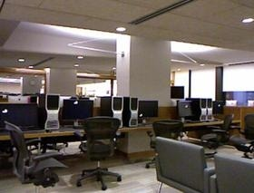
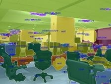
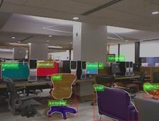
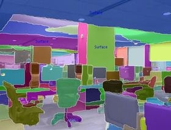
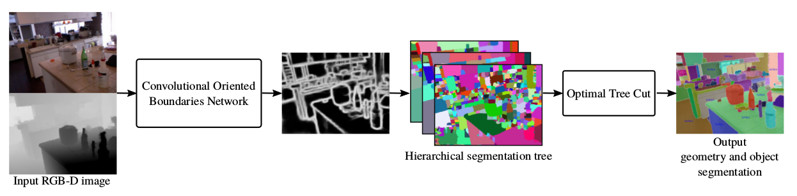

I will be interning at [Preferred Networks Inc](https://www.preferred-networks.jp/en/), Tokyo, Japan for the summers of 2018 starting May to the end of July. This will be my second visit to Japan. In my first visit, I was part of the team [KgpKubs](https://krssg.in) which participated in Robocup, Small Size League held at Nagoya. In this blog post, I'll present in detail the work that I do as part of my internship. I'll update this blog on weekly basis starting May 9th and is organized as follows:

Contents:
- [Introduction](#intro)
- [Related Work](#related)
- [Pre Mid-term presentation](#pre-mid)
- [Post Mid-term presentation](#post-mid)
- [References](#ref)

## Topic of Research (Introduction)
I would be working on ~~GANs~~ CNN-based navigation. Specifically, on geometric segmentation and class-agnostic object segmentation using a single RGB-D image and if time permits transition in applying this method to a mobile robot to do SLAM (Simultaneous Localization and Mapping). Although there has been a great progress in the field of semantic segmentation [] driven by deep learning methods, one major limitation is it's applications in Robotic systems in _open-set_ conditions. An autonomous robot ~~might~~ will encounter objects which are not in the class of labels for which a network is trained for and state-of-the-art methods [] fail miserably in this regard. One of the promising method in scene understanding (semantic segmentation) is SceneCut [] applied to indoor environments, a practical candidate for Robotic systems. **Fig 1** compares the result of multi-class semantic segmentation of some of the state-of-the-art methods.

  
  
  
  
  

    <b>Fig 1</b>: In order from left to right: Input Image and segmentations from RefineNet, Mask-RCNN and SceneCut. (Image taken from [])
  

From the above figure, it is clear that SceneCut is able to segment non-class objects such as walls, ceilings etc as well. But, considering the real-time performance of perception pipelines for Robotic Systems, SceneCut falls short in this regard taking nearly 5 seconds to process a single RGB-D frame.

And here comes my work as a summer intern. Building on the work of SceneCut, I will be working on making this pipeline to work in real-time.

## Related Work
I briefly present the working mechanism of SceneCut and the methods on which SceneCut builds upon.

SceneCut proposes a joint geometric and object segmentation method, a potential method in applying to object SLAM. This work is closely related to unsupervised segmentation methods used for object detection methods, which include the work of:

**Unsupervised Segmentation Methods**

- _Felzenszwalb and Huttenlocher_ []: Color image segmentation using graph based approach
   - A graph structure is imposed on the image
   - Edge weights are computed based on the color differences
   - A greedy merging algorithm is applied on the graph to obtain final segmentations
- _Karpathy et. al_ []: Use the above method to discover objects in 3D point cloud
   - Graph is constructed over the point cloud 
   - Edge weights are computed using colors and normals
- _Trevor et. al_ []:
   - Define binary edge weights for plane extraction
   - First, remove the points that belong to the detected planes
   - Remaining points are segmented into objects using Euclidean clustering
- _Pham et. al_ []:
   - Similar to the above method, rely on planes to segment objects in 3D

All the above mentioned methods are built on one common theme: **Decouple the object and plane segmentation**. Unlike the above mentioned methods, SceneCut jointly segments surfaces and dicovers object instances in an unified fashion.

**Limitations of Unsupervised Segmentation Methods**
- One has to tune the parameters to control the number of regions in the segmentations
- There is no single threshold or parameter that works for all objects and images in different conditions

**Overcoming the above limitations**\\
Hierarchial segmentation methods [] is one potential method. In this, multiple segmentations are nested in a tree-like structure and objects within are segmented at some level of the tree. But again, finding that particular level becomes difficult because objects are of different scales. One approach is to scale all the objects to one single level as presented in []. SceneCut, also built upon Hierarchial segmentation trees, searches for an optimal tree cut rather than scaling the objects to a particular level. They not only find the object instances but also find the plane surfaces. They accomplish this by maximizing a unified energy function.

**Work similar to that of SceneCut**
- _Gould et. al_ []
Use a learning based approach to segment outdoor scenes into ground plane and semantic class regions
- _Silberman et. al_ []
This paper applies to indoor scenes and the scenes are segmented into semantic objects and surface regions. In addition, they also estimate the relations between the surfaces and semantic classes

**Limitations of the above methods**
- The inference in the second method is based on a linear programming formulation which gets too expensive with increase in the number of nodes in the tree
- Most importantly, both the above methods face difficulties when encountering objects that are not seen during the train time

**Scaling up the above limitations**\\
SceneCut handles this by optimizing the above mentioned unified energy function using dynamic programming.

## SceneCut

  
  

    <b>Fig 2</b>: Pipeline of SceneCut. (Image taken from [])
  

## Pre Mid-term presentation
After nearly 1 month of work, it's time for the mid-term presentation.

## Post Mid-term presentation

## Conclusion

## References
