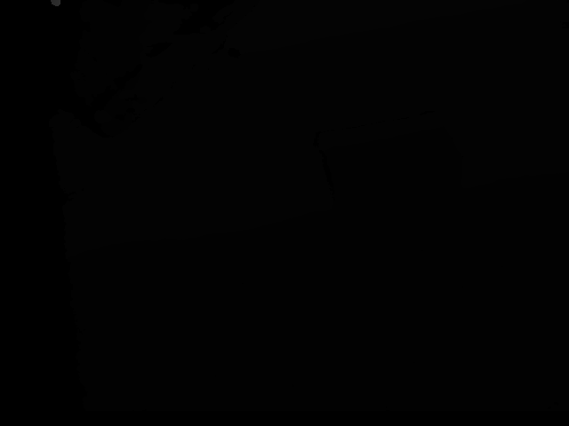
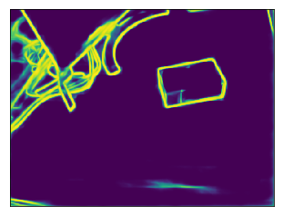

In this blog post I would like to explore the different ways in which an image can be interpreted. Specific to the problem of _contour estimation_ and _segmentation_, I present the multiple ways in which an image can be represented in different spaces. Narrowing down further, this post presents in detail the following:

- Different methods of Contour Estimation
- Deriving an Hierarchical Segmentation using the contour signal
- Construction of an UCM (Ultrametric Contour Map) from the above representation
- Finally, an hierarchical region tree represenation of the contour signal

This post is associated with the code that I release on [github](https://github.com/kvmanohar22/cob-chainer).

Brief contents of this post include the following:

- [Estimating contours and their corresponding orientation map](#est_contours)
- [Construction of closed set of contours](#construction)
- [Construction of UCM](#ucm)
- [Construction of Hierarchical Region Tree](#hier)
  - [Greedy Graph based Merging Algorithm](#greedy)
- [Further Reading](#further)
- [References](#ref)

## Estimating contours and their corresponding orientation map

Through out the blog, I shall use the following images as a reference to explain the details.

  
  
  

    <b>Fig 1</b>: Test samples used in this post. Left: RGB image and right image is it's corresponding depth map. Although the depth map looks completely blank, it's not.
  

The first task boils down to estimation of contours given an image. For the image given in Fig 1, the contours predicted from the network are as follows. These contours are predicted from the Convolutional Oriented Boundaries (COB) model.

 <b>Fig 2</b>: Initial contours predicted from the network. 

In the above contours diagram in Fig 2, the value at the location \\(\left(x, y\right)\\) can be interpreted as the probability that there is a contour at that particular location. Using the COB model, we also predict the orientations of the contours in the image which are presented in Fig 3. Note that we only predict quantized angles from 0 to \\(\pi\\) in multiples of \\(\pi/8\\).

  

  
  

    <b>Fig 3</b>: Quantized orientations predicted from the network. From top-left to bottom-left in clock-wise direction from zero to 180 degree
  

Note that in the above figure, at \\(\left(x, y, c_k\right) \enspace for \enspace k = 1, 2, ..., 8\\) location, each \\(c_k\\) represents the softmax probability (applied along the last dimension) that the pixel which is part of an edge has that quantized orientation. Taking the max. along the last dimension yields the orientation image for each pixel.

 <b>Fig 4</b>: Taking the max among all the above 8 orientations, gives the overall orientation of the pixels in the image.

We next compute the learned orientation map into 8 orientations assigning a random angle between \\(0\\) and \\(\pi\\) radians for those pixels which do not have any strong responses at any of the quantized orientations resulting in the following orientation map.

 <b>Fig 5</b>: Computing trained orientations from the above predicted quantized orientations

At this point, we have the contours estimation and the corresponding trained orientations predictd from the network.

Uncertaininity in the estimation of countours can be represented by a random variable which interprets the boundary strength as an estimate of the probability of that arc being a true contour. But what we are more interested in is the estimation of uncertainity in the segmentation of a region, which is not that straightforward. One highly exploited possibility is the **Ultrametric Contour Map (UCM)**. An UCM is represented as an hierarchy of regions. Further, an UCM is a real-valued image obtained by weighting each boundary by its scale of disappearance. For a given threshold (at a particular hieght of the tree) in such a tree representation, the output is a set of **closed** contours. In such a hierarchical tree representation, the leaves tend to be over-segmented (towards the bottom of the tree) and the top of the tree retain only regions with strong contours thus leading to under-segmentation. Between these two extremes there is a continous trade-off in the strength of boundary giving rise to an hierarchical set of regions at each level of the tree. Also note that for such a hierarchical representation, one must have the contours to obey the following two properties unlike the classical problem of low-level contour detection which allows those contours to be open curves.
- The contours must be closed
- The contours must be non-self intersecting

Well, with what we have in hand right now (the contuors and their corresponding orientations), we can neither guarantee that the contours are closed nor to be non-self intersecting. Estimation of closed set of contours is what we aim to solve in the following section.

## Construction of closed set of contours

Watershed Transform is an algorithm which comes in handy here. This treats the image as a terrain in an euclidean space and starts to fill the basins with water until the water from different regions doesn't cross each other. This generates a closed set of regions which is what we desire. This takes as input the image and an initial set of markers (local minima) from which the water starts to fill the corresponding basin regions. This returns an output image representing the closed set of regions. Fig 6 and 7 depict the input and output to watershed tranform respectively.

  

 <b>Fig 6</b>: Left: Input to watershed tranform. Middle: Local minima and on right is the image where the local minima are grouped together. This image is color coded. All the markers having the same color belong to the same basin.

  

 <b>Fig 7</b>: Left: Output of watershed transform. On the right is the image with extracted boundaries.

But the problem? This comes with a major set back. It has a lot of noise and it over segments the regions as is evident from the above image. But what is more important is to retain those closed set of regions.

One way to retain this closed set of regions is to select the edges predicted from the above and replace the contour strength by the mean of the values from the original contours predicted from the network which results in the following. I also present a different strategy used to weight the contours referred as the Oriented Watershed Tranform (OWT).

  

 <b>Fig 8</b>: Left: Naive way of weighting the contours. Right: Output of OWT. Note the strong horizontal contour signals along the slant contour towards the top-left of the left image.

Clearly, in the left image there are lot of artifacts than in the right image. And by artifacts I mean, a strong contour signal even though there isn't such in the original image. Why does this artifacts arise in the first place? The reason being simple. _Contour detectors produce spatially extended responses around strong boundaries_. When there is an edge with not so strong contour strength in the viscinity of a strong contour, it adds up in the mean producing a strong signal thus giving rise to artifacts. But the output of OWT resolves this issue to a certain extent which is quite evident from the above image.

Henceforth we use the reweighted contours from the right image from the above figure.

## Construction of UCM

Before the construction of Ultrametric Contour Map (UCM), what is an UCM anyway? An Ultrametric Contour Map is a real valued image obtained by weighting each boundary by its scale of disappearance. In such a representation, the strength of the contour represents the likelihood of that contour being a true boundary. **Most importantly** for any threshold \\(\alpha \in [0, 1]\\), the output is always a set of closed regions (contours).

## Construction of Hierarchical Tree Region

There exists a duality between the UCM and an hierarchical region tree. One of the best illustration I found depicting such a duality is shown in the figure below.

 <b>Fig 5</b>: Duality between UCM and a hierarchical region tree. Schematic view of the dual representation of a segmentation hierarchy as a region dendrogram and as an ultrametric contour map. (Source: MCG paper) 

Such a hierarchical region tree is obtained by merging contours from lowest contour strength to the highest contour strength. This leads to the construction of an hierarchical tree with tree size equal to the distinct number of contour strengths in the UCM. And at each level of the tree, the output is always a set of closed regions. Further, at the lowest level in the tree (leaves), the regions are over-segmented (have very fine detail) and as we go upper in the tree, the regions are more coarse in nature. Such a tree construction is referred to as the _Greedy Graph based Merging Algorithm_ which is presented below.

### Greedy Graph based Merging Algorithm

Let \\(\mathcal{P_o}\\) represent the minima of the regions of catchment basins, \\(\mathcal{K_o}\\) denote corresponding watershed arcs and \\(W\left(\mathcal{K_o} \right)\\) represent the measure of dissimilarity between the regions. In this case, the dissimilarity is the contour strength that separates two regions.

Such an hierarchy is constructed by a greedy graph-based region merging algorithm where the initial graph is defined as: \\( G = \left( \mathcal{P_o}, \mathcal{K_o}, W(\mathcal{K_o}) \right) \\)

$$
\begin{align}
   & 1. \enspace C^* = \underset{C \in \mathcal{K_o}}{argmin} \enspace W(C) \\
   & 2. \enspace \text{Let} \enspace R_1, R_2 \in \mathcal{P_o} \text{be the regions separated by} \enspace C^* \\
   & 3. \enspace Set \enspace R = R_1 \cup R_2 \\
   & 4. \enspace \mathcal{P_o} \leftarrow \mathcal{P_o} \sim \{R_1, R_2\} \cup {R} \enspace and \enspace \mathcal{K_o} \leftarrow \mathcal{K_o} \sim \{C^*\} \\
   & 5. \enspace \text{Stop if} \mathcal{K_o} \enspace \text{is empty} \\
\end{align}
$$

## Further Reading
In this blog post I explained about the construction of UCM and an hierarchical region tree from UCM. In the coming blog posts I will present the different things that can be accomplished by exploiting such a tree structure. These would be closely related to Image Segmentation / Semantic Segmentation / Instance Segmentation.

## References

<noscript>Please enable JavaScript to view the <a href="https://disqus.com/?ref_noscript">comments powered by Disqus.</a></noscript>

