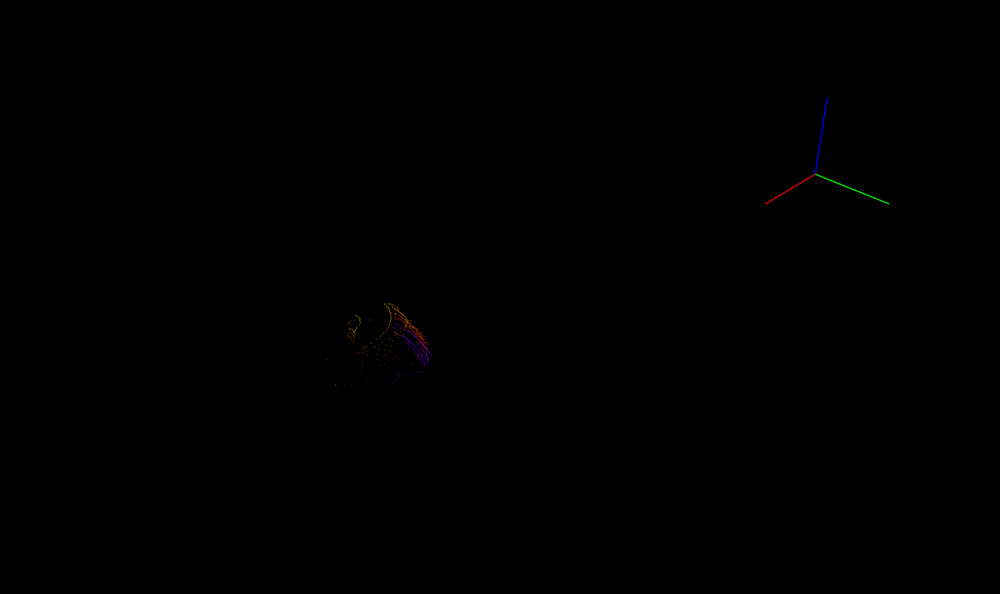
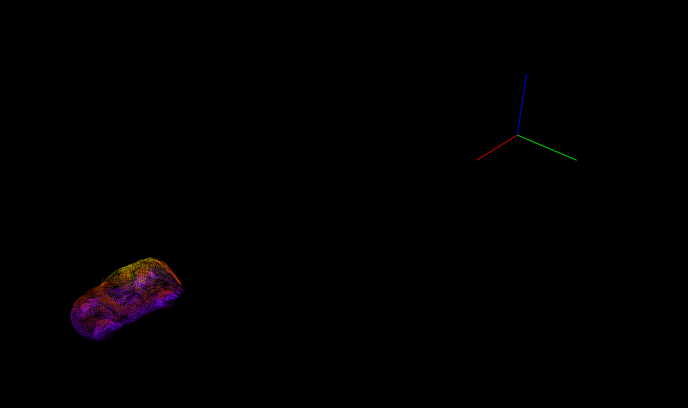
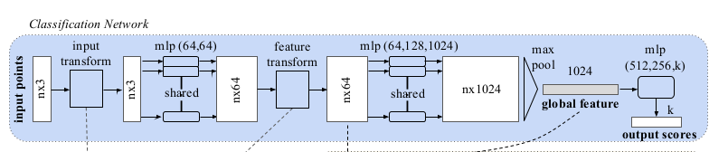
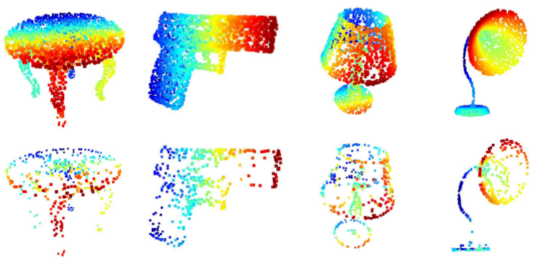
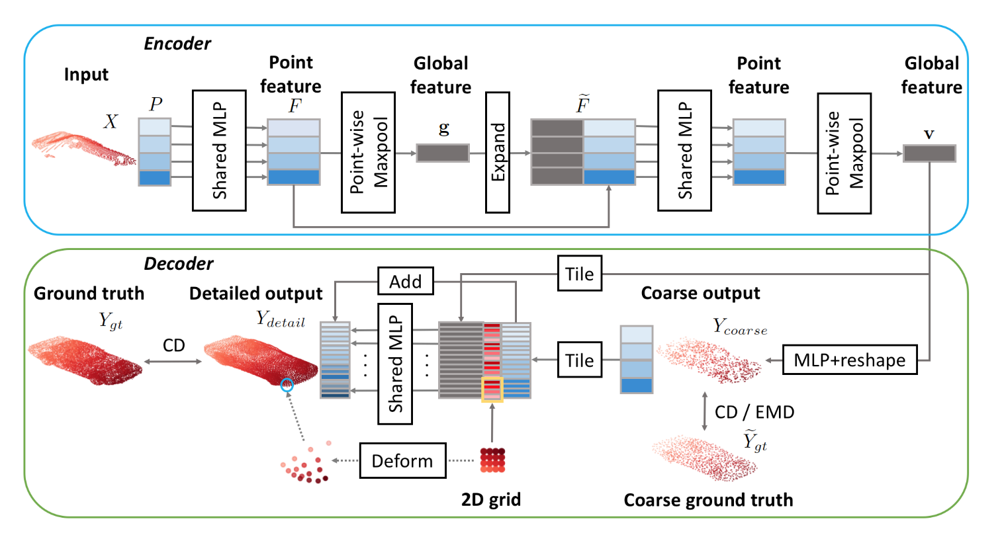

<link rel="stylesheet" href="./../css/prism.css">

This blog is part of my summer research internship at RITS, INRIA. I was very fortunate to colloborate with Max and Raoul. My work was focussed on uniform scene completion of Point Clouds. Doesn't ring a bell? Let me give more details;

The following is a 2D rendering of a Point Cloud from certain viewpoint. Can you identify what those points represent?

Not clear isn't it? How about the one below?

That's a car!

That's scene completion (or more precisely in this context; object completion). 

#### Problem Statement
Given a set of (sparse) points; generate dense set of points.

In the above case we were given a sparse set of points which although resemble a car but it is really difficult to identify them to be a car! The task at hand is to estimate dense set of points given such a sparse set of points.

This problem is tackled in Point Completion Networks (PCN) [1]. But my work was more generalized in the sense; you would want to uniformly sample dense set of points for any given general scene. How do you do that?

I will first describe some work related to point clouds and object completions. Most importantly I will briefly describe about the works of **PointNet**, **PointNet++**, **PCN** and **Frustum-PointNets**.

- [3D Representation](#3dr)
- [PointNet](#pointnet)
- [PointNet++](#pointnet2)
- [Point Completion Networks](#pcn)
- [Frustum PointNets](#pointnet)

The first two papers deal with representation of point cloud data and tasks on point cloud such as classification of point cloud (what does a given point cloud represent?), scene segmentation (what does each point in a scene correspond to?)

Before going any further, let's take a detour and get a overview of 3D representation and why deal with point clouds rather than say meshes or voxels.

## 3D Representation
Following are some of the representations of 3D data.

### Voxels
- These can be thought as 3D extension to pixels in 2D. In the sense that points are reguarly sampled from a 3D space
- This is probably the most widely used format in machine learning and are easily processed by CNNs
- Since this involves regular sampling processing becomes increasingly difficult at high resolutions
- This has very poor memory efficiency since one has to store all the regularly sampled points which grows as \\(O(n^3)\\)
- Graphic applications such as texture and lighting is difficult since they do not have surfaces

### Meshes
- This consists of vertices and surfaces. De-facto representation in graphics
- Since there is a sense of surface, texture and lighting can be easily applied
- Of all the three representations, these are highly scalable. Say you want to represent a very large triangle, polygon meshes only require 3 vertices and a face where as other two representations require a lot of sampling of points which is really expensive
- Also operations like rotation, translation and scaling can be easily be done by simple operations on vertices
- Although there has been recent work on using meshes for reconstructing an object, these are limited to simple CAD models containing a single object. The way these methods work is by deforming a predefined simple mesh model (say a sphere with 100 vertices). Further, these methods cannot be applied to complex tasks such as general 3D scene reconstruction because the number of vertices and faces is fixed in advance.

### Point Clouds
- This is similar to voxel representation but these are based on irregular sampling of points
- Since this involves irregular sampling, this is a better representation compared to voxels in terms of memory efficiency
- Again since this is based on irregular sampling, these are quite scalable compared to voxels
- Graphic applications such as texture and lighting is difficult since they do not have surfaces
- These can be generated from multiple ways; LiDAR, multi-view stereo, sampling from a 3D mesh (CAD) model etc.
- Processing point cloud is challenging since this is just a set of points which means the order in which the points are processed should not have an effect on the output

## PointNet

**Fig 1:** PointNet architecture. Image source: [1].

The network takes \\(n\\) points as input, generates a latent representation for each point independently and then aggregates point features by max pooling. The aggregated representation is the global signature of the input point cloud. What's most striking about the global signature is; these points correspond to some of the important points (key points) in the input point cloud. To make things easier; look at the following image;

**Fig 2:** Image taken from [1].

Top row is the input point cloud and the bottom row are the points that contributed to the global feature vector. As you can clearly see; the global feature vector summarizes the input point cloud with some critical points that define the shape of an object.

If you have read the above carefully; you might have picked on the fact that each point is treated independently. There is no consideration of local neighbourhood taken into account. Why is it even important in the first place?

## PointNet++
This is an extension of the PointNet paper; this paper handles some of the shortcomings of the latter. Major contribution includes;
- Handle local context using hierarchical point set feature learning
- Process varying densities of point clouds using density adaptive layers (Multi-scale grouping (MSG) and Multi-resolution grouping (MRG))

First things first; how does the method take local context into account? That's simple! Instead of generating a global feature vector from all the points, generate feature embeddings in local context. Given a set of points \\( \\{x_1, x_2, \dots, x_n\\}\\), there are three steps;
1. **Sampling** Choose subset of points \\(\\{x_{i_1}, x_{i_2}, \dots x_{i_m}\\}\\) called as the centroids
2. **Grouping** Around each point \\(x_{i_j}\\), we find radius \\(r_{i_j}\\) and collect all those points that fall within this ball.
3. **PointNet** Run a PointNet on each of these balls. This layer summarizes the neighbourhood around each of the above centroids

## Point Completion Networks (PCN):
Following is the architecture of the model.

Encoder is the same as that of PointNet paper. Main point of interest is the decoder. First; before going any further; how do we generate sparse and dense point sets? The paper uses CAD (mesh) models from ShapeNet dataset to sample points.

Given a mesh model; one can uniformly sample points and use this as dense point cloud representation. How do we generate sparse set? Can we just drop some points from the dense point cloud and call it sparse? Well, mathematically it will be sparse but will not be close to real world sparse-ness. Why? Real world sparse-ness is view-point dependent. What does that mean? Say you have a lidar fixed at some point and there is a car (front-faced) in it's viscinity. Now the point cloud generated from the lidar will contain only those points from the front of the car and not from it's back. However if the car were back-faced to the lidar then point cloud would have points sampled from the back of the car. Hence; sparse point cloud is view-dependent.

To generate sparse point cloud from mesh model, generate a random pose for the camera around the mesh and generate the depth of each point. And finally this depth can be back-projected into 3D using camera intrinsics.
